 

 

## About Me

I don't see software as just writing code — to me, it's about solving problems, building systems, and continuously improving them.

I'm sharpening my skills around web technologies, backend logic, and software architecture. My goal is to build clean, maintainable systems that hold up in the real world.

**Currently focused on:**

- Full-stack web development
- Backend services & API design
- Software architecture & system design
- Automation & workflow tooling

 

## Tech Stack

**Frontend**
 

  

**Backend & Languages**
 

  

**Database & DevOps**
 

 

## GitHub Stats

 

 

 

## Get in Touch

 

This profile isn't about how many repos I've shipped — it's about how I think as an engineer.

